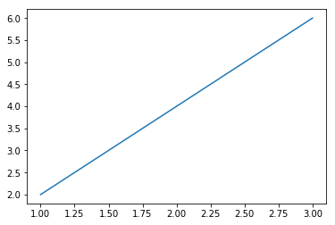

파이썬으로 풀어보는 수학
=========================

1장 숫자·연산
--------------
기초·수학 연산, 레이블(label), 다른 종류의 숫자,   
*fractions_ex.py : 분수표현 예제*  
복소수, 사용자 입력 가져오기, 예외와 유효하지 않은 입력값 처리, 입력값으로 분수와 복소수, 수리적 연산을 수행하는 프로그램 작성,  
*factors.py : 정수 팩터를 계산, 소인수 분해*  
*multi_table.py : 곱 테이블 출력하기*  
측정 단위 변환,   
*miles_kilometers.py : 단위변환, 마일과 킬로미터*  
*roots_quadratic_equation.py : 이차방정식의 해 계산기*   

2장 그래프로 데이터 가시화
---------------------------
카르테시안 좌표평면의 이해, 리스트와 튜플을 이용한 작업, 리스트나 튜플에 대한 실행 반복,   
*pylab_ex.py : 그래프 예제*  
```python
%matplotlib inline
%run pylab_ex.py
```



