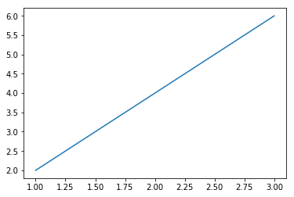
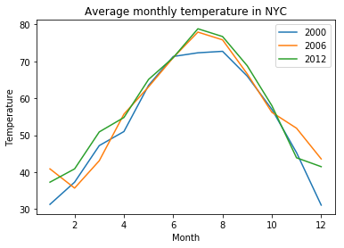
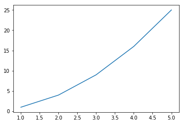

파이썬으로 풀어보는 수학
=========================

1장 숫자·연산
--------------
기초·수학 연산, 레이블(label), 다른 종류의 숫자,   
**fractions_ex.py : 분수표현 예제**  
복소수, 사용자 입력 가져오기, 예외와 유효하지 않은 입력값 처리, 입력값으로 분수와 복소수, 수리적 연산을 수행하는 프로그램 작성,  
**factors.py : 정수 팩터를 계산, 소인수 분해**  
**multi_table.py : 곱 테이블 출력하기**  
측정 단위 변환,   
**miles_kilometers.py : 단위변환, 마일과 킬로미터**  
**roots_quadratic_equation.py : 이차방정식의 해 계산기**   

2장 그래프로 데이터 가시화
---------------------------
카르테시안 좌표평면의 이해, 리스트와 튜플을 이용한 작업, 리스트나 튜플에 대한 실행 반복,   
**pylab_ex.py : 그래프 예제**  
***  
필수작업
```bash
$ pip3 install matplotlib
$ pip3 install jupyter notebook
```
***
```python
%matplotlib inline
%run pylab_ex.py
```



뉴욕시의 연간 평균온도를 그래프로 표시, 뉴욕시의 월간 온도 비교, 그래프 개인화,  
**newyork_temp.py : 뉴욕 2000, 2006, 2012 평균 월별 온도 그래프**   
```python
%run newyork_temp.py
```

  
축 조정, 
**pyplot_ex.py : pyplot을 사용해 그래프 그리기**  
```python
%run pyplot_ex.py
```


그래프 저장, 만유인력에 대한 뉴턴의 법칙, 포물선 운동, 동일간격별로 부동소수점 숫자 생성, 포물선 그리기, 서로 다른 초기 속도에 따른 궤적 비교, 
