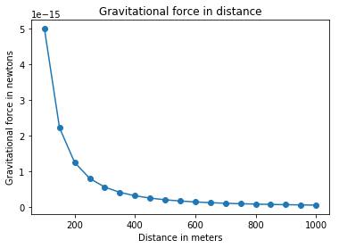
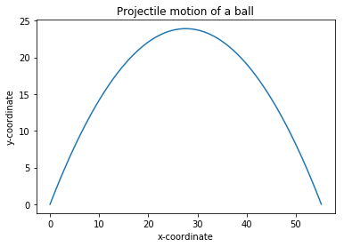
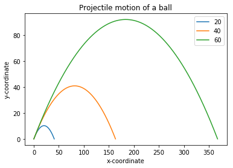

파이썬으로 풀어보는 수학
=========================

1장 숫자·연산
--------------
기초·수학 연산, 레이블(label), 다른 종류의 숫자,   
**fractions_ex.py : 분수표현 예제**  
복소수, 사용자 입력 가져오기, 예외와 유효하지 않은 입력값 처리, 입력값으로 분수와 복소수, 수리적 연산을 수행하는 프로그램 작성,  
**factors.py : 정수 팩터를 계산, 소인수 분해**  
**multi_table.py : 곱 테이블 출력하기**  
측정 단위 변환,   
**miles_kilometers.py : 단위변환, 마일과 킬로미터**  
**roots_quadratic_equation.py : 이차방정식의 해 계산기**   

2장 그래프로 데이터 가시화
---------------------------
카르테시안 좌표평면의 이해, 리스트와 튜플을 이용한 작업, 리스트나 튜플에 대한 실행 반복,   
**pylab_ex.py : 그래프 예제**  
***  
필수작업
```bash
$ pip3 install matplotlib
$ pip3 install jupyter notebook
```
***
```python
%matplotlib inline
%run pylab_ex.py
```


뉴욕시의 연간 평균온도를 그래프로 표시, 뉴욕시의 월간 온도 비교, 그래프 개인화,  
**newyork_temp.py : 뉴욕 2000, 2006, 2012 평균 월별 온도 그래프**   
```python
%run newyork_temp.py
```

  
축 조정, 
**pyplot_ex.py : pyplot을 사용해 그래프 그리기**  
```python
%run pyplot_ex.py
```

  
그래프 저장 pylab.savefig('pyplot_ex.png'),  
**gravitational_force.py : 만유인력에 대한 뉴턴의 법칙**  
```python
%run gravitational_force.py
```
  
포물선 운동, 동일간격별로 부동소수점 숫자 생성,   
**projectile_motion.py : 포물선 그리기**   
```python
%run projectile_motion.py
```
  
**three_speed_projectile.py : 서로 다른 초기 속도에 따른 궤적 비교**  
```python
%run three_speed_projectile.py
```
  

3장 통계값을 이용한 테이터 설명
---------------------------------
**calc_mean.py : 평균계산, **   
**calc_median.py : 중위수 계산, **  
**most_common.py : 최빈값 찾기, **  
**numbers_max_count.py : 여러 최빈값을 갖는 숫자 리스트를 대상으로 최빈값 계산, **  
**frequency_table.py : 빈도 테이블 생성, **  
**find_range.py : 숫자 집합의 범위 알아내기, **  
**calc_var_and_sd.py : 분산과 표준편차 계산, **   
**find_corr.py : 상관계수 계산, **   
**read_text_file.py : 텍스트 파일에서 데이터 읽기, **   
**read_text_calc_mean.py : 파일에 저장된 숫자의 평균을 계산, **   
**read_csv_file.py : csv 파일에서 데이터 읽어오기, **
